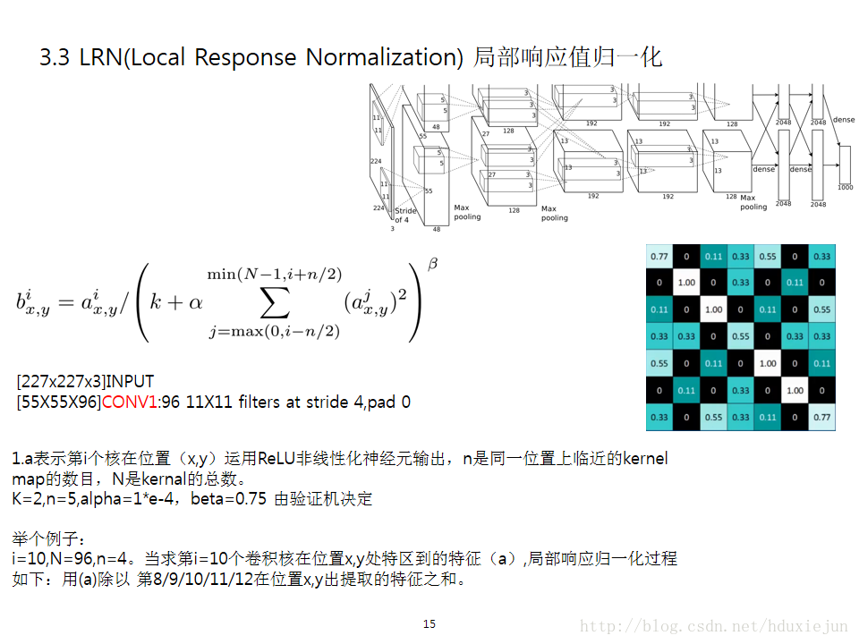
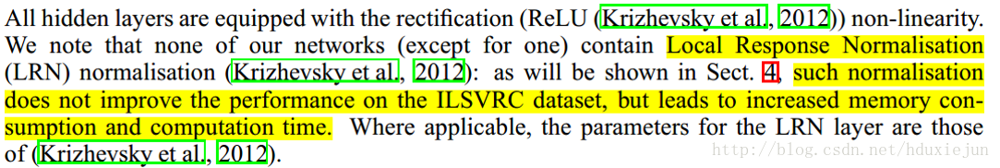

# 经典CNN模型复现

### LeNet -1998 Yan lucan
[LeNet5](./LeNet5.py)
### AlexNet
[AlexNet](./AlexNet.py)
### VGG-16/VGG-19
[VGG-19](./VGG-19.py)
### GoogLeNet

### ResNet

### Inceptionv4

### DenseNet

### MoblieNet

##### 预训练模型下载
http://www.vlfeat.org/matconvnet/pretrained/

## LRN(Local Response Normalization) 局部响应归一化

来源：[ImageNet Classification with Deep Convolutional Neural Networks](https://papers.nips.cc/paper/4824-imagenet-classification-with-deep-convolutional-neural-networks.pdf)

- 局部归一的动机：在神经生物学有一个概念叫做 侧抑制(lateral inhibitio)，指的是被激活的神经元抑制相邻神经元。归一化(normalization)目的是“抑制”，局部响应归一化就是借鉴侧抑制的思想来实现局部抑制，尤其是我们使用ReLU的时候这种“侧抑制”很管用。

- 优点：有利于增加泛化能力，做了平滑处理，识别率提高1%-2%。LRN层模仿生物神经系统的侧抑制，对局部神经元的活动创建竞争机制，使得响应比较大的值相对更大，提高模型泛化能力。Hinton在ImageNet中表明分别提升1.4%和1.2%

- 计算公式(2012 AlexNet)：

    

    公式看上去比较复杂，但理解起来非常简单。i表示在第i个核在位置(x,y)运用激活函数ReLU的输出，n是同一位置上临近的kernal map的数目，N是kernal的总数。参数K,n,alpha,beta都是超参数，一般设置k=2,n=5,aloha=1*e-4,beta=0.75。

- 后期争议 在2015年 VGG-16/19的文章中，提到LRN基本没什么用。

