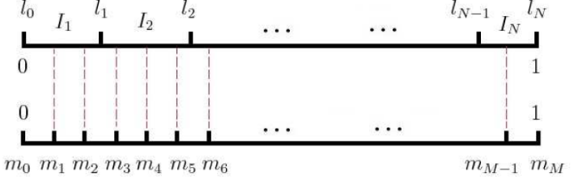

## Word2Vec

- Background

1. 词向量

    1. One-hot Representation

        NLP相关任务中最常见的第一步是创建一个词表库并把每个词顺序编号。这实际就是词表示方法中的One-hot Representation,这种方法把每个词顺序编号，每个词就是一个很长的向量，向量的维度等于词表的大小，只有对应位置上的数字为1，其他的都为0.在实际应用中，一般采用稀疏编码存储，主要采用词编号。

        这种表示法最大的问题就是无法捕捉词与词之间的相似度，就算是近义词也无法从词向量中看出任何关系。此外这种表示方法还容易发生维度灾难。尤其是在Deep Learning相关的一些应用中。
    2. Distributed Representation

         通过训练将每个词映射到K维实数向量（K为模型超参数），通过词d 之间的距离（cosine相似度，欧式距离等）来判断他们之间的语义相似程度。

2. 统计语言模型

    一个语言模型通常构建为字符串s的概率分布p(s),这里p(s)试图反映的是字符串s作为一个句子的频率。

    需要注意的是，与语言学中不同，语言模型与句子是否合乎语法是没有关系的，即使一个句子完全合乎语法逻辑，我们仍然可以认为它出现的概率为零。

    对于一个由l个基元（“基元”可以为字、词或短语等）构成的句子,其概率计算公式可以表示为

    

    

    其中的条件概率就是语言模型的参数，若这些参数已经全部算得，那么给定一个句子的就可以很快计算出相应的了。

    考虑一个给定的长度为T的句子，就需要计算T个参数，不妨假设语料库对应的词典的大小（词汇量）为N。那么，如果考虑长度为T的任意句子，理论上就有中可能，而每种可能都要计算T个参数，总共就需要个参数。这里只是简单估算，并没有考虑重复参数。

    参数的计算方法：

    - n-gram 模型

    - 决策树

    - 最大熵模型

    - 最大熵马尔可夫模型

    - 条件随机场

    - 神经网络

3. n-gram模型

    语言模型的概率并不好计算，不妨利用马尔可夫链的假设，当前这个词仅仅跟前面几个有限的词相关，因此也就不必追溯到最开始的那个词，这样便可以大幅缩减上诉算式的长度。即

    

    特别地，对于n取得较小值地情况

    当n=1,一个一元模型(unigram model)即为

    

    当n=2,一个二元模型(bigram model)即为

    

    当n=3,一个三元模型(trigram model)即为

    

    经过这样的简化后，不仅使得单个参数的统计变得更容易（统计时需要匹配的词串更短），也使得参数的总数变少了。

    那么，n-gram中的参数n取多大比较合适呢？一般来说，n的选取需要同时考虑计算复杂度和模型效果两个因素。

    | n | 模型参数的数量 |
    | ------------- |:-------------:|
    |1(unigram)|2*10^5|
    |2(bigram)|4*10^10|
    |3(trigram)|8*10^15|
    |4(4-gram)|16*10^20|

    上表给出了n-gram模型中的参数数量随着n的逐渐增大而变化的情况，其中假定词典的大小 N=200000.事实上，模型参数的量级是N的指数函数        ，显然n不能取得太大，实际应用中最多得是采用n=3的三元模型。在模型效果方面，理论上是n越大，效果越好。但需要注意的是，当n大到一定程度时，模型效果的提升幅度会变小。

    *n-gram的**平滑处理**也是十分重要的，这里不展开介绍（详见《统计自然语言处理》p86)*

    1. Laplacian (add-one) smoothing
　　2. Add-k smoothing
　　3. Jelinek-Mercer interpolation
　　4. Katz backoff
　　5. Absolute discounting
　　6. Kneser-Ney

    对于统计语言模型，利用*最大似然*，可把目标函数设为

    

    实际中，常采用最大对数似然，即把目标函数设为

    

    然后对这个函数进行最大化。

4. 神经概率语言模型

    

    传统的神经网络向量语言模型，输入层（词向量），隐藏层和输出层（softmax层）。里面的最大的问题在于从隐藏层到输出的softmax

5. 基于Hierarchical Softmax的模型

6. 基于Negative Sampling的模型

    Hierarchical Softmax的缺点与改进：使用霍夫曼树来代替传统的神经网络，可以提高模型训练的效率。但是如果我们的训练样本里的中心词w是一个很生僻的词，那么就得在霍夫曼树中辛苦的向下走很久了。

    Negative Sampling就是这么一种word2vec模型的方法，它摒弃了霍夫曼树，采用了Negative Sampling（负采样）的方法来求解，那么Negative Sampling具体是一种什么样的采样方法呢？比如我们有一个训练样本，中心词是w，它周围上下文共有2c个词，记为context(w)。由于这个中心词w的确和context（w）相关存在，因此它是一个真实的正例。通过Negative Sampling采样，我们得到neg个和w不同的中心词
    
    ，这样
    
    和
    
    就组成了neg个并不真实存在的负例。利用这一个正例和neg个负例，我们进行二元逻辑回归，得到负采样对应每个词
    
    对应的模型参数
    
    ，和每个词的词向量。

    从上面的描述可以看出，Negative Sampling由于没有采用霍夫曼树，每次只是通过采样neg个不同的中心词做负例，就可以训练模型，因此整个过程要比Hierarchical Softmax简单。

    梯度计算

    Negative Sampling也是采用了二元逻辑回归来求解模型参数，通过负采样，我们得到了neg个负例
    
    为了统一描述，我们将正例定义为。

    在逻辑回归中，我们的正例应该期望满足：

    

    我们的负例期望满足

    

    我们期望可以最大化下式：

    

    利用逻辑回归和上一节的知识，我们容易写出此时模型的似然函数为：

    

    此时对应的对数似然函数为：

    

    和Herarchical Softmax类似，我们采用随机梯度上升法，仅仅每次只用一个样本更新梯度，来进行迭代更新得到我们需要的
    
    这里我们需要求出
    
    的梯度。

    首先我们计算
    
    的梯度：

    

    

    再求
    
    的梯度：

    

    有了梯度表达式，我们就可以用梯度上升的方法进行迭代来一步步的求解我们需要的
    

    负采样方法：

    那如何进行负采样，得到neg个负例？如果词汇表的大小为V，那么我们就将一段长度为1的线段分为V份，每份对应词汇表中的一个词。当然没歌词对应的线段长度是不一样的，高频词对应的线段长，低频词对应的线段短。每个词w的线段长度由下式决定：

    

    在word2vec中，分子和分母都取了3/4次幂如下：

    

    在采样前，我们将这段长度为1的线段划分成M等份，这里M>>V，这样可以保证每个词对应的线段都会划分成对应的小块。而M份中的每一份都会落在某一个词对应的线段上。在采样的时候，我们只需要从M个位置中采样出neg个位置就行，此时采样到的每一个位置对应到的线段所属的词就是我们的负例词。

    

    在word2vec中，M取值默认为10^8。

- Inference

    [中英文维基百科语料上的Word2Vec实验](http://www.52nlp.cn/%E4%B8%AD%E8%8B%B1%E6%96%87%E7%BB%B4%E5%9F%BA%E7%99%BE%E7%A7%91%E8%AF%AD%E6%96%99%E4%B8%8A%E7%9A%84word2vec%E5%AE%9E%E9%AA%8C)

    [维基百科简体中文语料的获取](http://licstar.net/archives/262)

    [Deep Learning in NLP （一）词向量和语言模型](http://licstar.net/archives/328)

    [不可思议的Word2Vec(上)](http://xiaosheng.me/2017/10/16/article105/)

    [使用tensorflow实现word2vec中文词向量的训练](https://zhuanlan.zhihu.com/p/28979653)

    [自然语言处理中的N-Gram模型详解](https://blog.csdn.net/baimafujinji/article/details/51281816)
